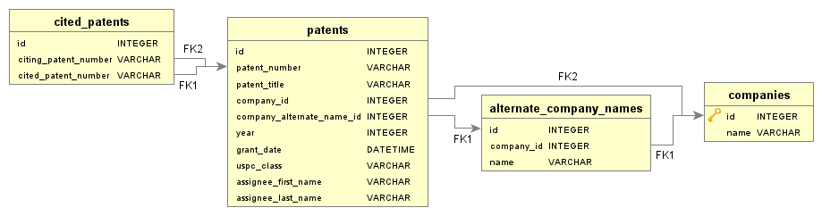

# PatentsView API wrapper

This project is a wrapper for the PatentsView API.

* [PatentsView Glossary](http://www.patentsview.org/api/glossary.html) provides a description of the variables.

## Remarks about the data

* Patent Numbers are alphanumeric (they can include letters)
* PatentsView only includes information about the patent at issue. It does not include changes to patent information after the patent has been issued.
    * This means that if the company changes name, it won't be reflected in the patent. Example: if "International Business Machines" renames itself to "IBM", patents issued to "International Business Machines" will still be issued to "International Business Machines" (and not "IBM").
    * As an example: `NETFLIX, INC.` has an `assignee_key_id` of `17594` and an `assignee_id` of `org_2lAuxOpAtNMvtTxhuLmX`; `NETFLIX.COM, INC.` on the other hand an `assignee_key_id` of `org_UNHkzir8tY7NlQrOJKT4` and an `assignee_id` of `363028`. (This of course assumes `NETFLIX, INC.` and `NETFLIX.COM, INC.` are the same company, which is highly probable).
    * The same applies for acquisitions. Example: Company A has patent *X*; once company B acquires company A, patent *X* would still show that it is assigned to company *A*.
    * Probably the same thing holds if a company acquires certain patents of another company.
* The patents can be assigned to organizations (as opposed to individuals). This is indicated by the 'assignee organization' field returned by the API.
* The assignee organizations (i.e. companies) are distinguished by name. Each organization name is a 'separate' company.
    * This means that a patent can be assigned to "IBM", "IBM Inc.", "International Business Machines".
    * Different organization names have different `assignee_id`s and `assignee_key_id`s (see `NETFLIX` example above).
 
## Adding companies

Create an Microsoft Excel spreadsheet (`.xlsx` file) with the following structure:


<table>
    <thead>
        <tr>
            <th>Firm ID</th>
            <th>Firm Name</th>
            <th>Alternative names </th>
            <th></th>
            <th></th>
            <th></th>
            <th></th>
            <th></th>
            <th></th>
            <th></th>
            <th></th>
            <th></th>
            <th></th>
            <th></th>
        </tr>
    </thead>
    <tbody>
        <tr>
            <td>ID2</td>
            <td>Company 2 Primary Name / Name 1</td>
            <td>Name 2</td>
            <td>Name 3</td>
            <td>Name 4</td>
            <td>Name 5</td>
            <td>Name 6</td>
            <td>Name 7</td>
            <td>Name 8</td>
            <td>Name 9</td>
            <td>Name 10</td>
            <td>...</td>
            <td>Name X</td>
        </tr>
        <tr>
            <td>ID1</td>
            <td>Company 1 Primary Name / Name 1</td>
            <td>Name 2</td>
            <td>Name 3</td>
            <td>Name 4</td>
            <td>Name 5</td>
            <td>Name 6</td>
            <td>Name 7</td>
            <td>Name 8</td>
            <td>Name 9</td>
            <td>Name 10</td>
            <td>...</td>
            <td>Name X</td>
        </tr>
    </tbody>
</table>


## Database Structure

Here is an Entity Relationship Diagram (ERD) of the database structure.



## Selecting Patents

Use the following to select patents 
```
SELECT
	p.patent_number as "Patent Number",
	p.patent_title as "Patent Title",
	-- p.company_id as "Company ID",
	c.name as "Company Name",
	-- p.company_alternate_name_id as "Alternate Name ID",
	an.name as "Company Name Listed on Patent",
	p.year,
	p.grant_date as "Grant Date",
	p.uspc_class as "USPC Classes"
FROM 
	patents as p
JOIN 
	companies as c
ON
	p.company_id = c.id
LEFT JOIN 
	alternate_company_names as an
ON
	p.company_alternate_name_id = an.id;
```

## Software Applications

* [DbVisualizer](https://www.dbvis.com/) was used to generate the graphs
* [DB Browser for SQLite](https://sqlitebrowser.org/) was used to look at the data and execute SQL queries
